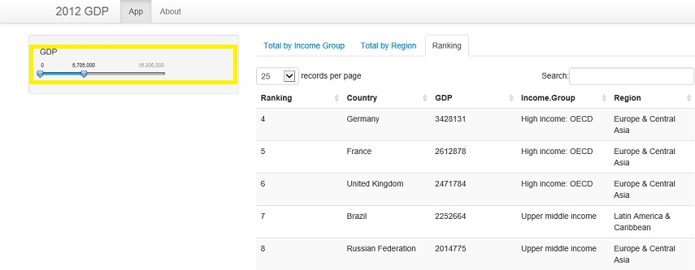

## 2012 GDP outcomes 

# This application uses 2012 GDP data and provides:
1. A bar chart grouping the GDP values by Income Group
2. A bar chart grouping the GDP values by Region
3. A table containing the ranking of Countries by GDP

--- .class #id 

## 2012 GDP functionalities

# You can filter the countries by their GDP just by using the slide bar:
<br>


--- .class #id

## 2012 GDP Data

# The data are loaded online:

```{r cache=TRUE, warning=FALSE}
library("plyr")
GDP <- read.csv("http://d396qusza40orc.cloudfront.net/getdata%2Fdata%2FGDP.csv", skip=5, header = FALSE, nrows=190)
GDP <- GDP[, c(1, 2, 4, 5)]
colnames(GDP) <- c("Code", "Ranking", "Country", "GDP")
GDP$Ranking <- as.integer(GDP$Ranking)
GDP$GDP <- as.numeric(gsub(",", "", gsub(" ", "", GDP$GDP)))

EDU <- read.csv("http://d396qusza40orc.cloudfront.net/getdata%2Fdata%2FEDSTATS_Country.csv")
mergedData <- merge(GDP, EDU, by.x="Code", by.y="CountryCode")
```

--- .class #id

## 2012 GDP - getting access

# You can get access to GDP application just by clicking:
<br>
<a href="https://wellingtoncunha.shinyapps.io/Project/" target="_blank">https://wellingtoncunha.shinyapps.io/Project/</a>

